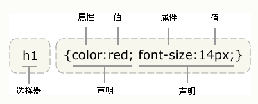
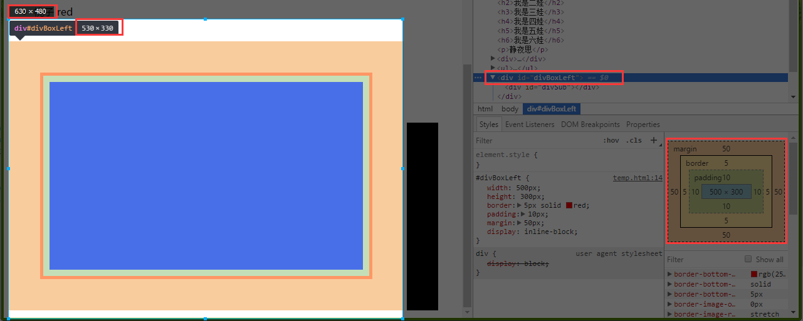

<!-- TOC -->

- [基础](#基础)
    - [语法](#语法)
    - [选择器](#选择器)
        - [标签选择器](#标签选择器)
        - [类选择器](#类选择器)
        - [ID选择器](#id选择器)
        - [子选择器](#子选择器)
        - [后代选择器(空格)](#后代选择器空格)
        - [通用选择器](#通用选择器)
        - [伪类选择器](#伪类选择器)
            - [超链接](#超链接)
            - [状态伪类](#状态伪类)
        - [分组选择器](#分组选择器)
    - [样式优先级](#样式优先级)
        - [样式继承](#样式继承)
        - [增加权重important](#增加权重important)
    - [元素分类](#元素分类)
        - [块状元素](#块状元素)
        - [内联元素（行内元素）](#内联元素行内元素)
        - [内联块元素](#内联块元素)
    - [盒子模型](#盒子模型)
        - [边框border](#边框border)
        - [内边距padding](#内边距padding)
        - [外边距margin](#外边距margin)
            - [外边距的叠加](#外边距的叠加)
        - [计算宽高](#计算宽高)
        - [box-size](#box-size)
        - [CSS3 Box-Model](#css3-box-model)

<!-- /TOC -->
<a id="markdown-基础" name="基础"></a>
# 基础

<a id="markdown-语法" name="语法"></a>
## 语法
由两部分构成：选择器，以及一条或多条声明。

简单的可以看成：
```css
选择器 {
    声明1;
    声明2;
    。。。
    声明N;
}
```

下面的示例中：

`h1 {color:red; font-size:14px;}`



<a id="markdown-选择器" name="选择器"></a>
## 选择器
<a id="markdown-标签选择器" name="标签选择器"></a>
### 标签选择器
根据html的标签名称进行选择，选择该页面所有该标签。

修改所有div内文字为红色：`div { color:red; }`

<a id="markdown-类选择器" name="类选择器"></a>
### 类选择器
根据html标签的class属性进行选择，选择所有该样式类的标签。
注意前面要加【.】号!

修改所有class名为iflytek-blue的元素的背景色为blue：
`.iflytek-blue { background-color : blue; }`

<a id="markdown-id选择器" name="id选择器"></a>
### ID选择器
根据html标签的id属性进行选择，选择id为该值的标签。
注意前面要加【#】号！

修改id为txtRemark文本框的宽度为300px：
`#txtRemark { width : 300px ;}`

<a id="markdown-子选择器" name="子选择器"></a>
### 子选择器
用于选择指定标签元素的第一代子元素，大于符号【>】

以下示例中仅子元素P显示为红色；

以下示例中span样式无效，因为不是第一代，已经隔代。
```html
<style type="text/css">
div>p {
    color: red;
}

ul>span {
    color: red;
}
</style>

<div>
    <p>子元素p</p>
    <span><p>后代元素p</p></span>
</div>
<ul>
    <li>桃子 <span>red</span> </li>
    <li>橘子 <span>red</span></li>
</ul>
```

<a id="markdown-后代选择器空格" name="后代选择器空格"></a>
### 后代选择器(空格)
用于选择指定标签元素下的后辈元素

基于【子选择器】示例中，子选择（>）修改为空格后，样式就都可以起作用了。

**`>`作用于元素的第一代后代，空格作用于元素的所有后代。**

<a id="markdown-通用选择器" name="通用选择器"></a>
### 通用选择器
匹配所有的标签，使用*

修改页面中所有元素字体颜色为红色：
`* { color : red; }`

<a id="markdown-伪类选择器" name="伪类选择器"></a>
### 伪类选择器

<a id="markdown-超链接" name="超链接"></a>
#### 超链接
名字很奇怪，它允许给html不存在的标签（标签的某种状态）设置样式。

比如说我们给html中一个标签元素的鼠标滑过的状态来设置字体颜色：

```html
/*链接没有被访问时前景色*/
a:link { color: gray; }

/*鼠标悬浮在链接上时前景色*/
a:visited { color: blue; }

/*链接被访问过后前景色*/
a:hover { color: red; }

/*鼠标点中激活链接那一下前景色*/
a:active { color: yellow; }
```

<a id="markdown-状态伪类" name="状态伪类"></a>
#### 状态伪类
":enabled",":disabled",":checked"伪类称为UI元素状态伪类，这些主要是针对于HTML中的Form元素操作。

比如"type="text"的input元素有enable和disabled两种状态，enable为可写，disable为不可写。

<a id="markdown-分组选择器" name="分组选择器"></a>
### 分组选择器
当我们需要对多个标签设置同一个样式，可以使用逗号分隔进行分组使用

对h1，h3，h5标题的字体颜色修改：
`h1,h3,h5{ color:red; }`

<a id="markdown-样式优先级" name="样式优先级"></a>
## 样式优先级
当同一个 HTML 元素被不止一个样式定义时，会使用哪个样式呢？

一般而言，所有的样式会根据下面的规则层叠于一个新的虚拟样式表中，其中数字 4 拥有最高的优先权。
1. 浏览器缺省设置
2. 外部样式表,如
```html
<head><link rel="stylesheet" type="text/css" href="my.css" /></head>
```
3. 内部样式表(位于 <head> 标签内部),如
```html
<style>#divTest{background:red;}</style>
```
4. 内联样式(在 HTML 元素内部),如
```html
<div id="divTest" style="background:red;"></div>
```

因此，内联样式(在 HTML 元素内部)拥有最高的优先权，这意味着它将优先于以下的样式声明：`<head>` 标签中的样式声明，外部样式表中的样式声明，或者浏览器中的样式声明(缺省值)。

**简而言之，就近原则！**

<a id="markdown-样式继承" name="样式继承"></a>
### 样式继承
所谓CSS的继承是指被包在内部的标签将拥有外部标签的样式性质。

具体可参考：
> http://www.cnphp.info/css-style-inheritance.html

<a id="markdown-增加权重important" name="增加权重important"></a>
### 增加权重important
!important为开发者提供了一个增加样式权重的方法。

```html
<body>
    <style>
        div {
            width: 100px;
            height: 100px;
        }

        #div1 {
            background: red;
        }

        #div1 {
            background: greenyellow;
        }

        #div2 {
            background: red !important;
        }

        #div2 {
            background: greenyellow;
        }
    </style>
    <div id="div1">div1</div>
    <div id="div2">div2</div>
</body>
```

非到万不得已不要用!important。如果你是出于懒惰使用!important，为了避免例行的调试而滥用它，那么你（或者是那些后继开发你项目的人）将会深受其害。

<a id="markdown-元素分类" name="元素分类"></a>
## 元素分类
很重要的一个属性**display**

<a id="markdown-块状元素" name="块状元素"></a>
### 块状元素
`display:block;`

**块级元素特点：**

1. 每个块级元素都从新的一行开始，并且其后的元素也另起一行。（真霸道，一个块级元素独占一行）
2. 元素的高度、宽度、行高以及顶和底边距都可设置。
3. 元素宽度在不设置的情况下，是它本身父容器的100%（和父元素的宽度一致），除非设定一个宽度。

常用的有：
`<div>、<p>、<h1>...<h6>、<ol>、<ul>、<dl>、<table>、<form>`

<a id="markdown-内联元素行内元素" name="内联元素行内元素"></a>
### 内联元素（行内元素）
`display:inline`

**内联元素特点：**
1. 和其他元素都在一行上；
2. 元素的高度、宽度及顶部和底部边距不可设置；
3. 元素的宽度就是它包含的文字或图片的宽度，不可改变。

常用的有：
`<a>、<span>、<br>、<label>、<select>、<em>`

<a id="markdown-内联块元素" name="内联块元素"></a>
### 内联块元素
`display:inline-block;`同时具备内联、块状元素特点。

**inline-block 元素特点：**
1. 和其他元素都在一行上；
2. 元素的高度、宽度、行高以及顶和底边距都可设置。

常用的有：
`、<input>`

<a id="markdown-盒子模型" name="盒子模型"></a>
## 盒子模型
所有HTML元素可以看作盒子，在CSS中，"box model"这一术语是用来设计和布局时使用。

CSS盒模型本质上是一个盒子，封装周围的HTML元素，它包括：边距，边框，填充，和实际内容。

<a id="markdown-边框border" name="边框border"></a>
### 边框border
`border:1px solid red;`

等价于

```css
<style>
    border-width:1px;
    border-style:solid;
    border-color:red;
</style>
```

除了solid实线的样式，还有以下样式：


其中border宽度也可以分开设置：
border-top，border-right，border-bottom，border-left

比如，可以针对标题进行特殊设置：
```html
h3 {
  border-top: 4px solid #7c7; /* 中绿 */
  background-color: #efe;     /* 浅绿 */
  color: #050;                /* 深绿 */
  }
```

<a id="markdown-内边距padding" name="内边距padding"></a>
### 内边距padding
元素边框和内容的距离，记住设置的顺序！

```html
padding: 1px;

padding: 1px 10px;

padding: 1px 10px 20px 30px;
```

<a id="markdown-外边距margin" name="外边距margin"></a>
### 外边距margin
元素之间的距离，也叫边界。
设置同padding

<a id="markdown-外边距的叠加" name="外边距的叠加"></a>
#### 外边距的叠加
外边距叠加是一个相当简单的概念。 但是，在实践中对网页进行布局时， 它会造成许多混淆。 

简单的说， 当两个或更多个垂直边距相遇时， 它们将形成一个外边距。这个外边距的高度等于两个发生叠加的外边距的高度中的较大者。

但是注意只有普通文档流中块框的垂直外边距才会发生外边距叠加。 行内框、 浮动框或绝对定位框之间的外边距不会叠加。

一般来说， 垂直外边距叠加有三种情况：
* 元素自身叠加 当元素没有内容（即空元素）、内边距、边框时， 它的上下边距就相遇了， 即会产生叠加（垂直方向）。 当为元素添加内容、 内边距、 边框任何一项， 就会取消叠加。
* 相邻元素叠加 相邻的两个元素， 如果它们的上下边距相遇，即会产生叠加。
* 包含（父子）元素叠加 包含元素的外边距隔着 父元素的内边距和边框， 当这两项都不存在的时候， 父子元素垂直外边距相邻， 产生叠加。 添加任何一项即会取消叠加。

```html
<body>
    <style>
        div {
            width: 100px;
            height: 100px;
            background: #ccc;
        }

        #div1 {
            margin: 10px;
        }

        #div2 {
            margin: 50px;
        }
    </style>
    <div id="div1"></div>
    <div id="div2"></div>
</body>
```

针对上例中，div1和div2垂直间距应该是多少？ 10px + 50px？ 还是 50px？

<a id="markdown-计算宽高" name="计算宽高"></a>
### 计算宽高
一个元素的宽度究竟该怎么计算？

对于下面的示例中#divBoxLeft元素的实际宽度为
500(width)+10x2(padding)+5x2(border) = 530
但是该元素实际占用宽度为530+50x2(margin) = 630
```html
<style>
    #divBoxLeft {
        display: inline-block;
        width: 500px;
        height: 300px;
        border: 5px solid red;
        padding: 10px;
        margin: 50px;
    }
    
    #divSub {
        width: 100%;
        height: 100%;
        background-color: blue;
    }

    #divBoxRight {
        display: inline-block;
        width: 50px;
        height: 300px;
        background-color: black;
    }
</style>

<div id="divBoxLeft">
    <div id="divSub"></div>
</div>
<div id="divBoxRight"></div>
```

chrome调试工具提示我们该元素宽度为530px，并不表示该元素只占用了530px的宽度，
实际用截图工具量出的布局占据宽度为630px，如下图：



但是，**元素宽高的计算并不包含margin值**，margin可以为负值，表示偏移，想想如果计算包含margin的话，那元素宽高岂不是会变成负数？

```html
<style>
    #div1 {
        width: 100px;
        height: 100px;
        padding: 5px;
        border: 1px solid red;
        background: #ccc;
        margin-right: -100px;
    }
</style>
<div id="div1"></div>
```

针对如上html标记，我们可以看出div1的宽度为112，如果计算margin的话，是错误的。
```js
document.getElementById("div1").offsetWidth;//112
```

<a id="markdown-box-size" name="box-size"></a>
### box-size

盒子模型分为了w3c盒子和IE盒子。

两者的区别在于w3c盒子的width和height仅指content部分，没有包含padding和border部分，所以设置宽高的时候不会包含padding和border。

但是IE盒子模型的width和height包含padding和border部分，所以设置宽高的时候，会因为padding和border的关系而导致实际内容宽高受影响，当然现在的IE盒子已经和W3C保持一致了，这种特殊的盒子是在_IE 5.X_ 版本。

<a id="markdown-css3-box-model" name="css3-box-model"></a>
### CSS3 Box-Model
在最新的css3规范中，使用box-size属性对盒子模型的宽高计算进行区分，具体如下：

box-size属性值 | 布局所占宽度（高度略）
------------|------------
content-box（默认） | Width = width + padding-left + padding-right + border-left + border-right
border-box | Width = width(包含padding-left + padding-right + border-left + border-right)

通过以下案例，设置两个div的不同box-size属性，可以看出宽度是否包含padding和border的区别：
```html
<body>
    <style>
        div {
            width: 100px;
            height: 100px;
            background: #ccc;
            padding: 0 10px;
            border: 5px solid red;
            margin: 0 50px;
        }

        #div1 {
            /*默认box-size*/
            box-sizing: content-box;
        }

        #div2 {
            box-sizing: border-box;
        }
    </style>
    <script>
        function getInfo() {
            var str = "div1-" + document.getElementById("div1").offsetWidth + "\n";
            str += "div2-" + document.getElementById("div2").offsetWidth + "\n";
            alert(str);
        }
    </script>
    <div id="div1">div1</div>
    <div id="div2">div2</div>
    <input type="button" onclick="getInfo()" value="显示宽度">
</body>
```

针对上例代码，通过宽度的显示，我们可以看出来两种box-size的区别，border-box的宽高是包含padding和border进行考虑的。

