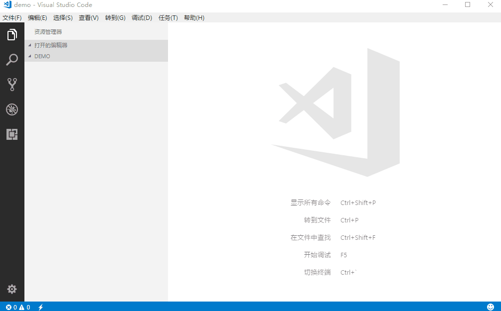

<!-- TOC -->

- [结构](#结构)
    - [声明](#声明)
    - [结构](#结构-1)
    - [head标签](#head标签)
    - [工具](#工具)

<!-- /TOC -->
<a id="markdown-结构" name="结构"></a>
# 结构
<a id="markdown-声明" name="声明"></a>
## 声明
<!DOCTYPE>声明有助于浏览器中正确显示网页。
网络上有很多不同的文件，如果能够正确声明HTML的版本，浏览器就能正确显示网页内容。
``` html
<!--H5文档头-->
<!DOCTYPE html>

<!--H4文档头-->
<!DOCTYPE HTML PUBLIC
"-//W3C//DTD HTML 4.01//EN"
"http://www.w3.org/TR/html4/strict.dtd">

```


<a id="markdown-结构-1" name="结构-1"></a>
## 结构
HTML有自己固定的结构：
``` html
<html>
    <head>...</head>
    <!--body里的内容才会显示在页面-->
    <body>...</body>
</html>
```

1. &lt;html&gt; 称为根标签，所有的网页标签都在<html></html>中。

2. &lt;head&gt; 标签用于定义文档的头部，它是所有头部元素的容器。头部元素有title、script、style、link、meta等标签。

3. 在&lt;body&gt;标签之间的内容是网页的主要内容，如nav、div、form、img等网页内容标签，在这里的标签中的内容会在浏览器中显示出来。

``` html
<!DOCTYPE html>
<html>
    <head>
        <meta http-equiv="Content-Type" content="text/html; charset=utf-8">
        <title>文档结构</title>
    </head>
    <body>
        <header></header>
        <nav></nav>
        ......
    </body>
</html>
```

<a id="markdown-head标签" name="head标签"></a>
## head标签
文档的头部描述了文档的各种属性和信息，包括文档的标题等。绝大多数文档头部包含的数据都不会真正作为内容显示给读者。
- title (`<title>标题</title>`)
- meta (`<meta http-equiv="Content-Type" content="text/html; charset=utf-8">`)
- link (`<link rel="stylesheet" type="text/css" href="theme.css" /> `)
- style (`<style></style>`)
- script (`<script></script>`)

<a id="markdown-工具" name="工具"></a>
## 工具
常用的纯前端开发工具有：

免费开源 VSCODE，极力推荐，配置简单，插件丰富，内存优化极高，微软良心之作！
>https://code.visualstudio.com/

付费神器 Sublime，免费可用，但要经受弹窗干扰
>http://www.sublimetext.com/

Hbuilder，H5开发利器，但因提示很多可能会影响一定的性能
>http://dcloud.io/

后面的课程全部以VSCODE作为IDE，创建一个html文档非常的简单，新建html扩展文件，输入!，然后直接tab键快速插入html模板。如下图：



其他犀利操作和插件自行百度研究