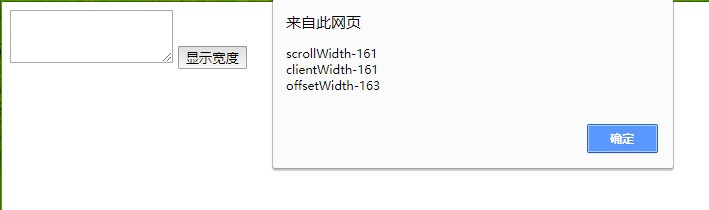
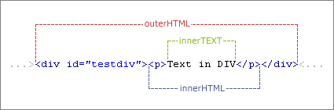

<!-- TOC -->

- [概述](#概述)
    - [BOM(Browser Object Model)](#bombrowser-object-model)
        - [window对象](#window对象)
        - [navigator对象](#navigator对象)
        - [screen 对象](#screen-对象)
        - [location对象](#location对象)
        - [history 对象](#history-对象)
    - [DOM(Document Object Model)](#domdocument-object-model)
        - [查找元素](#查找元素)
        - [元素节点属性](#元素节点属性)
        - [遍历节点树](#遍历节点树)
        - [DOM操作](#dom操作)
        - [属性操作](#属性操作)
        - [scrollWidth/clientWidth/offsetWidth](#scrollwidthclientwidthoffsetwidth)
        - [innerText/innerHTML/outerHTML/outerText](#innertextinnerhtmlouterhtmloutertext)
    - [BOM和DOM](#bom和dom)

<!-- /TOC -->
<a id="markdown-概述" name="概述"></a>
# 概述
<a id="markdown-bombrowser-object-model" name="bombrowser-object-model"></a>
## BOM(Browser Object Model)
ECMAScirpt是JavaScript的核心，在Web中使用JavaScript，那么BOM无疑才是真正的核心。

BOM的核心是window，而window对象又具有双重角色，它既是通过js访问浏览器窗口的一个接口，又是一个Global（全局）对象。

这意味着在网页中定义的任何对象，变量和函数，都以window作为其global对象。

* BOM是browser object model的缩写，简称浏览器对象模型
* BOM提供了独立于内容而与浏览器窗口进行交互的对象
* 由于BOM主要用于管理窗口与窗口之间的通讯，因此其核心对象是window
* BOM由一系列相关的对象构成，并且每个对象都提供了很多方法与属性
* BOM缺乏标准，JavaScript语法的标准化组织是ECMA，DOM的标准化组织W3C
* BOM最初是Netscape浏览器标准的一部分


每当我们打开一个网页，都会弹出一个窗口，这个浏览器窗口就是window对象呈现的一种形态。window对象是JavaScript层级中的顶层对象。

如果文档包含框架（frame 或 iframe 标签），浏览器会为 HTML 文档自动创建一个 window 对象，并为每个框架创建一个额外的 window 对象。

所有 JavaScript 全局对象、函数以及变量均自动成为 window 对象的成员。

window的主对象主要有如下几个：


<a id="markdown-window对象" name="window对象"></a>
### window对象
window 对象表示浏览器中打开的窗口。
如果文档包含框架（frame 或 iframe 标签），浏览器会为 HTML 文档创建一个 window 对象，并为每个框架创建一个额外的 window 对象。

window 对象表示一个浏览器窗口或一个框架。在客户端 JavaScript 中，window 对象是全局对象，所有的表达式都在当前的环境中计算。

也就是说，要引用当前窗口根本不需要特殊的语法，可以把那个窗口的属性作为全局变量来使用。

例如，可以只写 document，而不必写 window.document。

同样，可以把当前窗口对象的方法当作函数来使用，如只写 alert()，而不必写 window.alert()。

除了上面列出的属性和方法，window 对象还实现了核心 JavaScript 所定义的所有全局属性和方法。

window 对象的 window 属性和 self 属性引用的都是它自己。当你想明确地引用当前窗口，而不仅仅是隐式地引用它时，可以使用这两个属性。

除了这两个属性之外，parent 属性、top 属性以及 frame[] 数组都引用了与当前 window 对象相关的其他 window 对象。

属性 | 描述
---|---
closed | 返回窗口是否已被关闭。
defaultStatus | 设置或返回窗口状态栏中的默认文本。
document | 对 Document 对象的只读引用。请参阅 Document 对象。
history | 对 History 对象的只读引用。请参数 History 对象。
innerheight | 返回窗口的文档显示区的高度。
innerwidth | 返回窗口的文档显示区的宽度。
length | 设置或返回窗口中的框架数量。
location | 用于窗口或框架的 Location 对象。请参阅 Location 对象。
name | 设置或返回窗口的名称。
Navigator | 对 Navigator 对象的只读引用。请参数 Navigator 对象。
opener | 返回对创建此窗口的窗口的引用。
outerheight | 返回窗口的外部高度。
outerwidth | 返回窗口的外部宽度。
pageXOffset | 设置或返回当前页面相对于窗口显示区左上角的 X 位置。
pageYOffset | 设置或返回当前页面相对于窗口显示区左上角的 Y 位置。
parent | 返回父窗口。
Screen | 对 Screen 对象的只读引用。请参数 Screen 对象。
self | 返回对当前窗口的引用。等价于 window 属性。
status | 设置窗口状态栏的文本。
top | 返回最顶层的先辈窗口。
window | window 属性等价于 self 属性，它包含了对窗口自身的引用。
screenLeft/screenTop/screenX/screenY | 只读整数。声明了窗口的左上角在屏幕上的的 x 坐标和 y 坐标。IE、Safari 和 Opera 支持 screenLeft 和 screenTop，而 Firefox 和 Safari 支持 screenX 和 screenY。

方法 | 描述
---|---
alert() | 显示带有一段消息和一个确认按钮的警告框。
blur() | 把键盘焦点从顶层窗口移开。
clearInterval() | 取消由 setInterval() 设置的 timeout。
clearTimeout() | 取消由 setTimeout() 方法设置的 timeout。
close() | 关闭浏览器窗口。
confirm() | 显示带有一段消息以及确认按钮和取消按钮的对话框。
createPopup() | 创建一个 pop-up 窗口。
focus() | 把键盘焦点给予一个窗口。
moveBy() | 可相对窗口的当前坐标把它移动指定的像素。
moveTo() | 把窗口的左上角移动到一个指定的坐标。
open() | 打开一个新的浏览器窗口或查找一个已命名的窗口。
print() | 打印当前窗口的内容。
prompt() | 显示可提示用户输入的对话框。
resizeBy() | 按照指定的像素调整窗口的大小。
resizeTo() | 把窗口的大小调整到指定的宽度和高度。
scrollBy() | 按照指定的像素值来滚动内容。
scrollTo() | 把内容滚动到指定的坐标。
setInterval() | 按照指定的周期（以毫秒计）来调用函数或计算表达式。
setTimeout() | 在指定的毫秒数后调用函数或计算表达式。

参考：[window对象](http://www.w3school.com.cn/jsref/dom_obj_window.asp)

<a id="markdown-navigator对象" name="navigator对象"></a>
### navigator对象
简单来说，Navigator对象是获取使用者浏览器信息的对象。

虽然没有应用于 navigator 对象的公开标准，不过所有浏览器都支持该对象。

下面列举了关于 navigator 对象的属性与方法，有兴趣可以了解一下。

属性 | 描述
---|---
appCodeName | 返回浏览器的代码名。
appMinorVersion | 返回浏览器的次级版本。
appName | 返回浏览器的名称。
appVersion | 返回浏览器的平台和版本信息。
browserLanguage | 返回当前浏览器的语言。
cookieEnabled | 返回指明浏览器中是否启用 cookie 的布尔值。
cpuClass | 返回浏览器系统的 CPU 等级。
onLine | 返回指明系统是否处于脱机模式的布尔值。
platform | 返回运行浏览器的操作系统平台。
systemLanguage | 返回 OS 使用的默认语言。
userAgent | 返回由客户机发送服务器的 user-agent 头部的值。
userLanguage | 返回 OS 的自然语言设置。

<a id="markdown-screen-对象" name="screen-对象"></a>
### screen 对象
属性 | 描述
---|---
availHeight | 返回显示屏幕的高度 (除 Windows 任务栏之外)。
availWidth | 返回显示屏幕的宽度 (除 Windows 任务栏之外)。
bufferDepth | 设置或返回调色板的比特深度。
colorDepth | 返回目标设备或缓冲器上的调色板的比特深度。
deviceXDPI | 返回显示屏幕的每英寸水平点数。
deviceYDPI | 返回显示屏幕的每英寸垂直点数。
fontSmoothingEnabled | 返回用户是否在显示控制面板中启用了字体平滑。
height | 返回显示屏幕的高度。
logicalXDPI | 返回显示屏幕每英寸的水平方向的常规点数。
logicalYDPI | 返回显示屏幕每英寸的垂直方向的常规点数。
pixelDepth | 返回显示屏幕的颜色分辨率（比特每像素）。
updateInterval | 设置或返回屏幕的刷新率。
width | 返回显示器屏幕的宽度。

<a id="markdown-location对象" name="location对象"></a>
### location对象
表示载入窗口的URL，也可用window.location引用它  

属性 | 描述
---|---
hash | 设置或返回从井号 (#) 开始的 URL（锚）。
host | 设置或返回主机名和当前 URL 的端口号。
hostname | 设置或返回当前 URL 的主机名。
href | 设置或返回完整的 URL。
pathname | 设置或返回当前 URL 的路径部分。
port | 设置或返回当前 URL 的端口号。
protocol | 设置或返回当前 URL 的协议。
search | 设置或返回从问号 (?) 开始的 URL（查询部分）。

方法 | 描述
---|---
assign() | 加载新的文档。
reload() | 重新加载当前文档。
replace() | 用新的文档替换当前文档。

<a id="markdown-history-对象" name="history-对象"></a>
### history 对象
history 对象包含用户（在浏览器窗口中）访问过的 URL。

history 对象是 window 对象的一部分，可通过 window.history 属性对其进行访问。

属性 | 描述
---|---
length | 返回浏览器历史列表中的 URL 数量。

方法 | 描述
---|---
back() | 加载 history 列表中的前一个 URL。
forward() | 加载 history 列表中的下一个 URL。
go() | 加载 history 列表中的某个具体页面。


<a id="markdown-domdocument-object-model" name="domdocument-object-model"></a>
## DOM(Document Object Model)
DOM是JavaScript操作网页的接口，全称为“文档对象模型”（Document Object Model）。它的作用是将网页转为一个JavaScript对象，从而可以用脚本进行各种操作（比如增删内容）。

严格地说，DOM不属于JavaScript，但是操作DOM是JavaScript最常见的任务，而JavaScript也是最常用于DOM操作的语言。

由于HTML文档被浏览器解析后就是一棵DOM树，要改变HTML的结构，就需要通过JavaScript来操作DOM。

<a id="markdown-查找元素" name="查找元素"></a>
### 查找元素
W3C提供了比较方便的定位节点的方法和属性，如下所示：

| 方法 | 说明 | 
| ------------- |:-------------:| 
| getElementById() | 获取特定ID元素的节点 | 
| getElementsByTagName() | 获取相同元素的节点列表 | 
| getElementsByName() | 获取相同名称的节点列表 | 
| getElementsByClassName() | 通过类名获取节点列表 | 

<a id="markdown-元素节点属性" name="元素节点属性"></a>
### 元素节点属性

节点属性 | 说明
-----|---
nodeName | 返回一个字符串，其内容是节点的名字
nodeType | 返回一个整数，这个数值代表给定节点的类型
nodeValue | 返回给定节点的当前值
tagName | 获取元素节点的标签名
innerHTML | 获取元素节点的内容，**包含**标签本身
innerText | 获取元素节点的内容，**过滤**标签本身

<a id="markdown-遍历节点树" name="遍历节点树"></a>
### 遍历节点树

遍历节点树 | 说明
------|---
childNodes | 返回一个数组，这个数组由给定元素的子节点构成
children    |   返回一个数组，这个数组由给定元素的子节点构成；childNodes元素版本
childElementCount   |   返回子元素（不包括文本节点和注释）的个数
firstChild | 返回第一个子节点
firstElementChild   |   指向第一个子元素；firstChild的元素版。
lastChild | 返回最后一个子节点
lastElementChild    |   指向最后一个子元素；lastChild的元素版。
parentNode | 返回一个给定节点的父节点
nextSibling | 返回给定节点的下一个子节点
nextElementSibling  |   指向最后一个同辈元素；nextSibling的元素版。
previousSibling | 返回给定节点的上一个子节点
previousElementSibling  |   指向前一个同辈元素；previousSibling的元素版。

<a id="markdown-dom操作" name="dom操作"></a>
### DOM操作
DOM通过创建树来表示文档，描述了处理网页内容的方法和接口，从而使开发者对文档的内容和结构具有空前的控制力，用DOM API可以轻松地删除、添加和替换节点。

DOM操作 | 说明
------|---
creatElement(element) | 创建一个新的元素节点
creatTextNode() | 创建一个包含给定文本的新文本节点
appendChild() | 指定节点的最后一个节点列表后添加一个新的子节
insertBefore() | 将一个给定节点插入到一个给定元素节点的给定子节点的前面
removeChild() | 从一个给定元素中删除子节点
replaceChild() | 把一个给定父元素里的一个子节点替换为另外一个节点

<a id="markdown-属性操作" name="属性操作"></a>
### 属性操作
元素节点提供四个方法，用来操作属性。

方法名 | 说明
----|---
getAttribute() | 获取属性值，只会返回字符串，对所有属性适用
setAttribute() | 设置属性值，对所有属性适用
hasAttribute() | 返回一个布尔值，表示当前元素节点是否包含指定属性。
removeAttribute() | 用于从当前元素节点移除属性。

使用dom操作在html文档中添加一个红色的，宽500px，高200px，id为divContent的div

```js
var child = document.createElement("div");
child.setAttribute("id","divContent");
child.setAttribute("style","background-color:red;width:500px;height:200px;");
document.getElementsByTagName("body")[0].appendChild(child);
```

<a id="markdown-scrollwidthclientwidthoffsetwidth" name="scrollwidthclientwidthoffsetwidth"></a>
### scrollWidth/clientWidth/offsetWidth
document元素有三个宽度属性：

属性 | 描述
---|---
element.scrollWidth | 返回元素的可见宽度，不包边线宽度，会随对象中内容超过可视区后而变大
element.clientWidth | 返回元素的宽度，不包滚动条等边线，会随对象显示大小的变化而改变
element.offsetWidth | 返回元素的整体宽度，包滚动条等边线，会随对象显示大小的变化而改变

下面我们通过一个案例来进行区分说明：
```html
<!DOCTYPE html>
<html>

<head>
    <meta charset="UTF-8">
    <title>Document</title>
    <script>
        function getInfo() {
            var str = "scrollWidth-" + document.getElementById("t1").scrollWidth + "\n";
            str += "clientWidth-" + document.getElementById("t1").clientWidth + "\n";
            str += "offsetWidth-" + document.getElementById("t1").offsetWidth + "\n";
            alert(str);
        }
    </script>
</head>

<body>
    <!-- wrap="off" 表示停用单词换行，若不设置无横向滚动条 -->
    <textarea id="t1" wrap="off"></textarea>
    <input type="button" onclick="getInfo()" value="显示宽度" />
</body>

</html>
```

上述案例中，默认的textarea的scrollWidth和clientWidth是相等的，而offsetWidth是包含边框的宽度，如图：



当textarea内容超出元素宽度时，scrollWidth和clientWidth是不一样的，如图：


同样的，scrollHeight、clientHeight、offsetHeight高度也是一样的道理。

<a id="markdown-innertextinnerhtmlouterhtmloutertext" name="innertextinnerhtmlouterhtmloutertext"></a>
### innerText/innerHTML/outerHTML/outerText


<a id="markdown-bom和dom" name="bom和dom"></a>
## BOM和DOM
DOM描述了处理网页内容的方法和接口，BOM描述了与浏览器进行交互的方法和接口。

参考引用：

[BOM和DOM详解](https://segmentfault.com/a/1190000000654274)

[HTML DOM Element 对象](http://www.w3school.com.cn/jsref/dom_obj_all.asp)