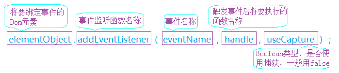
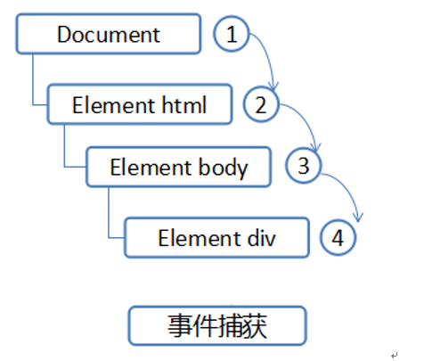
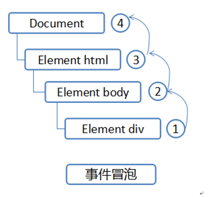
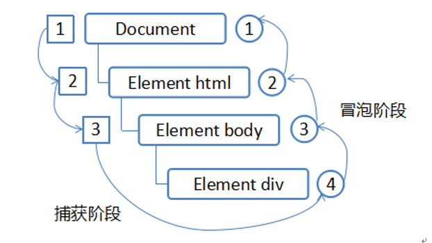

<!-- TOC -->

- [事件](#事件)
    - [前导](#前导)
    - [简单事件](#简单事件)
    - [监听函数](#监听函数)
        - [HTML标签的on-属性](#html标签的on-属性)
        - [Element节点的事件属性](#element节点的事件属性)
        - [addEventListener()](#addeventlistener)
        - [removeEventListener()](#removeeventlistener)
        - [dispatchEvent()](#dispatchevent)
        - [总结](#总结)
    - [事件传播](#事件传播)
        - [捕获](#捕获)
        - [冒泡](#冒泡)
        - [Dom标准的事件模型](#dom标准的事件模型)

<!-- /TOC -->
<a id="markdown-事件" name="事件"></a>
# 事件
JavaScript与HTML之间的交互是通过事件实现的。

用户或浏览器自身执行操作而触发的某种动作。诸如click , dblclick, mouseover 等都是事件的名字，onclick，ondblclick，onmouseover等都是事件的触发方法。

<a id="markdown-前导" name="前导"></a>
## 前导
我们需要了解一下html文档在网页上的运行顺序。当我们打开一个html文档时，网页会从上到下依次读取文档，构建DOM文档树，并将内容显示出来。

若遇到链接或图片等内容时，html中的DOM文档树继续构建，网页在后台并行下载链接中的内容。

但是当网页读取到js代码时，所有构建及下载暂停，需要将js代码全部加载完成后才能继续构建网页。

那么回归正题，我们可以在js代码中改变页面DOM文档树，但是在页面加载时，若加载的js代码改变了一个还构造完成的节点，页面就会报错。

所以我们需要确保DOM文档树加载完成后，才执行js代码。

window.onload方法会在DOM节点树加载完成后触发，此时DOM文档树加载完成，可以通过js代码随意操作。

<a id="markdown-简单事件" name="简单事件"></a>
## 简单事件
```html
<body onkeypress="on_Keypress();">
  <input type="button"value="单击鼠标触发事件"onclick="on_Click();"/>
  <br />
  <br />
  <input type="button"value="双击鼠标触发事件"ondblclick="on_Dblclick();"/>
  <br />
  <br />
  <input type="button"value="按下鼠标触发事件"onmousedown="on_Mousedown();"/>
  <br />
  <br />
  <input type="button"value="按下鼠标松开时触发事件"onmouseup="on_Mouseup();"/>
  <br />
  <br />
  <input type="button"
  value="移动鼠标到按钮触发事件"onmouseover="on_Mouseover();"/>
  <br />
  <br />
  <input type="button"value="移开鼠标触发事件"onmouseout="on_Mouseout();"/>
  <br />
  <br />
  <input type="button"value="按下键盘按键触发事件"/>
  <script type="text/javascript">
    function on_Click() {
      alert("你点击了按钮，通过onclick方法触发了click事件");
    }

    function on_Dblclick() {
      alert("你双击了按钮，通过ondblclick方法触发了dblclick事件");
    }

    function on_Mousedown() {
      alert("你按下了按钮，通过onmousedown方法触发了mousedown事件");
    }

    function on_Mouseup() {
      alert("你按下鼠标并松开了，通过onmouseup方法触发了mouseup事件");
    }

    function on_Mouseover() {
      alert("鼠标移动到了按钮，通过onmouseover方法触发了mouseover事件");
    }

    function on_Mouseout() {
      alert("鼠标移出了按钮，通过onmouseout方法触发了mouseout事件");
    }

    function on_Keypress() {
      alert("你按下按键了，通过onkeypress方法触发了keypress事件");
    }
  </script>
</body>
```

<a id="markdown-监听函数" name="监听函数"></a>
## 监听函数
监听函数（listener）是事件发生时，程序所要执行的函数。它是事件驱动编程模式的主要编程方式。

DOM提供三种方法，可以用来为事件绑定监听函数。

<a id="markdown-html标签的on-属性" name="html标签的on-属性"></a>
### HTML标签的on-属性
HTML语言允许在元素标签的属性中，直接定义某些事件的监听代码。

注意，使用这种方法时，on-属性的值是将会执行的代码，而不是一个函数。
```js
<!-- 正确 -->
<body onload="doSomething()">

<!-- 错误 -->
<body onload="doSomething">
```

<a id="markdown-element节点的事件属性" name="element节点的事件属性"></a>
### Element节点的事件属性
Element节点对象有事件属性，同样可以指定监听函数。
```js
window.onload = doSomething;

div.onclick = function(event){
  console.log('触发事件');
};
```

<a id="markdown-addeventlistener" name="addeventlistener"></a>
### addEventListener()
通过Element节点、document节点、window对象的addEventListener方法，也可以定义事件的监听函数。

用法如下：
```js
// 使用格式
elementObject.addEventListener(eventName, handle[, useCapture]);
```



值得注意的是：上图中的eventName，即事件名称，并没有“on”，例如鼠标单击事件click ，鼠标双击事件doubleclick ，鼠标移入事件mouseover，鼠标移出事件mouseout等。

```js
function hello() {
  console.log('Hello world');
}
var button = document.getElementById('btn');
button.addEventListener('click', hello, false);
```

addEventListener方法可以为当前对象的同一个事件，添加多个监听函数。这些函数按照添加顺序触发，即先添加先触发。

如果为同一个事件多次添加同一个监听函数，该函数只会执行一次，多余的添加将自动被去除（不必使用removeEventListener方法手动去除）。

```js
function hello() {
  console.log('Hello world');
}

//重复绑定hello函数，click只会触发一次
document.addEventListener('click', hello, false);
document.addEventListener('click', hello, false);
```

如果希望向监听函数传递参数，可以用匿名函数包装一下监听函数。

```js
function print(x) {
  console.log(x);
}

var el = document.getElementById('div1');
el.addEventListener('click', function () { print('Hello'); }, false);
```

<a id="markdown-removeeventlistener" name="removeeventlistener"></a>
### removeEventListener()
removeEventListener方法用来移除addEventListener方法添加的事件监听函数。

removeEventListener方法的参数，与addEventListener方法完全一致。它的第一个参数“事件类型”，大小写敏感。

注意，removeEventListener方法移除的监听函数，必须与对应的addEventListener方法的参数完全一致，而且必须在同一个元素节点，否则无效。
```js
function first() {
    alert('first function');
}

function second() {
    alert('second function');
}

document.getElementById('btn').addEventListener('click', first, false);
document.getElementById('btn').addEventListener('click', second, false);

//移除first函数的绑定，按钮事件只会出发second函数
document.getElementById('btn').removeEventListener('click', first, false);
```

<a id="markdown-dispatchevent" name="dispatchevent"></a>
### dispatchEvent()
dispatchEvent方法在当前节点上触发指定事件，从而触发监听函数的执行。

该方法返回一个布尔值，只要有一个监听函数调用了Event.preventDefault()，则返回值为false，否则为true。
```js
function first() {
    alert('first function');
}

document.getElementById('btn').addEventListener('click', first, false);

//加载js时即进行触发click事件，绑定了几个函数则触发几个函数
document.getElementById('btn').dispatchEvent(new Event('click'));
```


<a id="markdown-总结" name="总结"></a>
### 总结
在上面三种方法中，第一种“HTML标签的on-属性”，违反了HTML与JavaScript代码相分离的原则；

第二种“Element节点的事件属性”的缺点是，同一个事件只能定义一个监听函数，也就是说，如果定义两次onclick属性，后一次定义会覆盖前一次。

因此，这两种方法都不推荐使用，除非是为了程序的兼容问题，因为所有浏览器都支持这两种方法。

addEventListener是推荐的指定监听函数的方法。它有如下优点：

* 可以针对同一个事件，添加多个监听函数。
* 能够指定在哪个阶段（捕获阶段还是冒泡阶段）触发回监听函数。
* 除了DOM节点，还可以部署在window、XMLHttpRequest等对象上面，等于统一了整个JavaScript的监听函数接口。

<a id="markdown-事件传播" name="事件传播"></a>
## 事件传播
当一个事件发生以后，它会在不同的DOM节点之间传播（propagation）。这种传播分成三个阶段：

1. 第一阶段：从window对象传导到目标节点，称为“捕获阶段”（capture phase）。
2. 第二阶段：在目标节点上触发，称为“目标阶段”（target phase）。
3. 第三阶段：从目标节点传导回window对象，称为“冒泡阶段”（bubbling phase）。

我们已经知道DOM(文档对象模型)结构是一个树型结构，事实上，当一个HTML元素产生一个事件时，该事件会在元素结点与根节点之间按特定的顺序传播，路径所经过的节点都会收到该事件，这个传播过程可称为DOM事件流。

若要了解DOM事件流，我们需要先了解两种事件顺序类型：事件捕捉和事件冒泡。

<a id="markdown-捕获" name="捕获"></a>
### 捕获
捕获型事件与冒泡型刚好相反，由DOM树最顶层元素一直到最精确的元素。



<a id="markdown-冒泡" name="冒泡"></a>
### 冒泡
顾名思义，事件像个水中的气泡一样一直往上冒，直到顶端。从DOM树型结构上理解，就是事件由叶子节点沿祖先结点一直向上传递直到根节点；从浏览器界 面视图HTML元素排列层次上理解就是事件由具有从属关系的最确定的目标元素一直传递到最不确定的目标元素，冒泡型事件的基本思想是事件按照从特定的事件目标开始到最不确定的事件目标。



<a id="markdown-dom标准的事件模型" name="dom标准的事件模型"></a>
### Dom标准的事件模型
DOM标准的事件流包括三个阶段：事件捕获阶段、处于目标阶段和冒泡阶段。

首先发生的是事件捕获，为截获事件提供了机会。然后是实际的目标接收到事件。最后一个阶段是 冒泡阶段，可以在这个阶段对事件作出响应。



我们可以通过一个简单的示例来模拟：

```html
<body id="_body">
  <div id="_div"style="width: 500px; height:200px; background:#EAEAEA;">
    <input id="btn"type="button"value="确定"/>
  </div>
  <script type="text/javascript">
    function myclick1() {
      alert("按钮被点击了");
    }

    function myclick2() {
      alert("div被点击了");
    }

    function myclick3() {
      alert("body被点击了");
    }

    // 将addEventListener方法最后一个参数全部修改为true再试试效果
    document.getElementById("btn").addEventListener("click", myclick1, false);
    document.getElementById("_div").addEventListener("click", myclick2, false);
    //document.getElementById("_body").addEventListener("click", myclick3, false);
  </script>
</body>
```

参考引用：

[阮一峰 JavaScript 标准参考教程](http://javascript.ruanyifeng.com/)