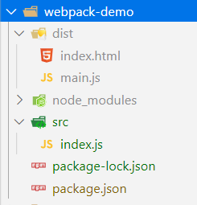

<!-- TOC -->

- [Webpack](#webpack)
    - [安装](#安装)
        - [NPM准备](#npm准备)
        - [安装webpack](#安装webpack)
        - [基本安装过程](#基本安装过程)
    - [开始](#开始)

<!-- /TOC -->


<a id="markdown-webpack" name="webpack"></a>
# Webpack
可以做的事情：
* 代码转换（ES6、Less、Sass）
* 文件优化（压缩、混淆、合并）
* 代码分隔（公共部分）
* 模块合并
* 自动刷新
* 代码校验
* 自动发布

前置知识点：
* Node.js基础
* npm使用
* ES6基础

<a id="markdown-安装" name="安装"></a>
## 安装

<a id="markdown-npm准备" name="npm准备"></a>
### NPM准备
首先安装Node.js，

首先需要对文件执行npm初始化项目：
```
npm init
```

使用 npm init 指令创建项目描述文件 package.json。

package.json 文件里记录项目的描述信息：项目作者、项目描述、项目依赖哪些包、插件配置信息等等数不清的好处。

* name 项目名称
* version 项目的版本号
* description 项目的描述信息
* entry point 项目的入口文件
* test command 项目启动时脚本命令
* git repository 如果你有 Git 地址，可以将这个项目放到你的 Git 仓库里
* keywords 关键词
* author 作者叫啥
* license 项目要发行的时候需要的证书，平时玩玩忽略它

<a id="markdown-安装webpack" name="安装webpack"></a>
### 安装webpack

要安装最新版本或特定版本，请运行以下命令之一：
```
npm install --save-dev webpack
npm install --save-dev webpack@<version>
```

如果你使用 webpack 4+ 版本，你还需要安装 CLI。（推荐！！！）
```
npm install webpack webpack-cli --save-dev
```

对于大多数项目，我们建议本地安装。

<a id="markdown-基本安装过程" name="基本安装过程"></a>
### 基本安装过程

首先我们创建一个目录，初始化 npm，

然后在本地安装 webpack，接着安装 webpack-cli（此工具用于在命令行中运行 webpack）

```
mkdir webpack-demo && cd webpack-demo
npm init -y
npm install webpack webpack-cli --save-dev
npm install lodash --save-dev # Lodash是一个一致性、模块化、高性能的 JavaScript 实用工具库。
```

关于`--save-dev`，当你为你的模块安装一个依赖模块时，正常情况下你得先安装他们（在模块根目录下npm install module-name），

然后连同版本号手动将他们添加到模块配置文件package.json中的依赖里（dependencies）。

--save和--save-dev可以省掉你手动修改package.json文件的步骤。

```
npm install moduleName # 安装模块到项目目录下
npm install moduleName --save # --save 的意思是将模块安装到项目目录下，并在package文件的dependencies节点写入依赖。
npm install moduleName --save-dev # --save-dev 的意思是将模块安装到项目目录下，并在package文件的devDependencies节点写入依赖。
```

<a id="markdown-开始" name="开始"></a>
## 开始
在项目根路径下创建【src】文件夹，并在文件夹内新增【index.js】文件：
```js
// 导入lodash库
import _ from 'lodash';

function component() {
  var element = document.createElement('div');

  // Lodash（目前通过一个 script 脚本引入）对于执行这一行是必需的
  element.innerHTML = _.join(['Hello', 'webpack'], ' ');

  return element;
}

document.body.appendChild(component());
```

在项目根路径下创建【dist】文件夹，用于存放输出文件，新增【index.html】文件：
```html
<!doctype html>
<html>

<head>
    <title>起步</title>
</head>

<body>
    <script src="main.js"></script>
</body>

</html>
```

执行 npx webpack，会将我们的脚本作为入口起点，然后 输出 为 main.js，项目结构图如下：



在浏览器中打开 index.html，如果一切访问都正常，你应该能看到以下文本：'Hello webpack'。


---

参考引用：

[Webpack中文](https://www.webpackjs.com/)


