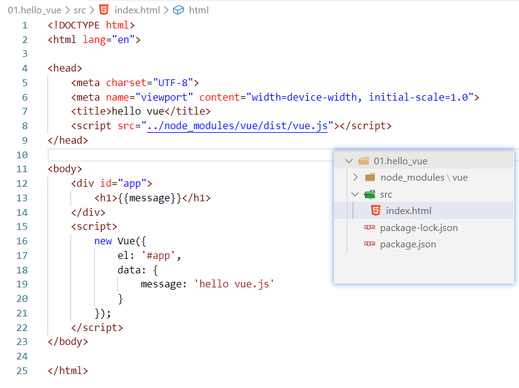
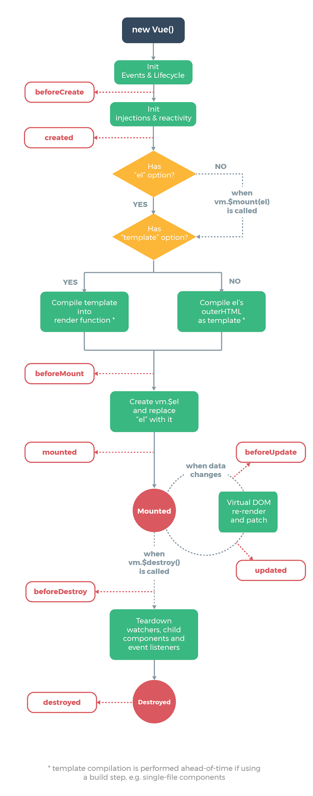
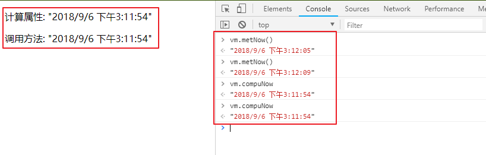

<!-- TOC -->

- [基本使用](#基本使用)
    - [安装初体验](#安装初体验)
    - [实例](#实例)
        - [数据与方法](#数据与方法)
        - [实例生命周期钩子](#实例生命周期钩子)
        - [生命周期图示](#生命周期图示)
    - [模板语法](#模板语法)
        - [插值](#插值)
            - [文本](#文本)
            - [原始HTML](#原始html)
            - [属性](#属性)
            - [JS表达式](#js表达式)
        - [指令](#指令)
            - [参数](#参数)
            - [修饰符](#修饰符)
            - [缩写](#缩写)
    - [条件渲染](#条件渲染)
        - [v-if](#v-if)
        - [v-show](#v-show)
        - [v-if vs v-show](#v-if-vs-v-show)
    - [列表渲染](#列表渲染)
        - [v-for](#v-for)
            - [数组v-for](#数组v-for)
            - [对象v-for](#对象v-for)
        - [数组更新检测](#数组更新检测)
        - [对象更新注意](#对象更新注意)
    - [Class 与 Style 绑定](#class-与-style-绑定)
        - [绑定Class和Style](#绑定class和style)
            - [对象绑定class](#对象绑定class)
            - [数组绑定class](#数组绑定class)
            - [绑定内联样式](#绑定内联样式)
    - [事件处理](#事件处理)
        - [事件处理方法](#事件处理方法)
        - [内联处理器](#内联处理器)
        - [事件修饰符](#事件修饰符)
        - [按键修饰符](#按键修饰符)
    - [指令小结](#指令小结)
    - [表单输入绑定](#表单输入绑定)
    - [计算属性和侦听器](#计算属性和侦听器)
        - [基础例子](#基础例子)
            - [计算属性缓存vs方法](#计算属性缓存vs方法)
            - [计算属性和侦听属性](#计算属性和侦听属性)
            - [计算属性的setter](#计算属性的setter)
        - [侦听器](#侦听器)
    - [综合案例](#综合案例)
        - [音乐播放器](#音乐播放器)
        - [行政区域筛选](#行政区域筛选)

<!-- /TOC -->

<a id="markdown-基本使用" name="基本使用"></a>
# 基本使用

<a id="markdown-安装初体验" name="安装初体验"></a>
## 安装初体验
使用 npm 命令初始化，然后安装 vue 框架：

```shell
# 初始化项目，生成 package.json 文件
npm init
# 以开发模式安装 Vue 框架
npm install vue -D
```

创建 html 页面，项目结构及代码如下所示：



<a id="markdown-实例" name="实例"></a>
## 实例
每个 Vue 应用都是通过用 Vue 函数创建一个新的 Vue 实例开始的：

```js
var vm = new Vue({
  // 选项
})
```

虽然没有完全遵循 MVVM 模型，但是 Vue 的设计也受到了它的启发。

因此在文档中经常会使用 vm (ViewModel 的缩写) 这个变量名表示 Vue 实例。

<a id="markdown-数据与方法" name="数据与方法"></a>
### 数据与方法
当一个 Vue 实例被创建时，它向 Vue 的响应式系统中加入了其 data 对象中能找到的所有的属性。

当这些属性的值发生改变时，视图将会产生“响应”，即匹配更新为新的值。

```js
// 我们的数据对象
var data = { a: 1 }

// 该对象被加入到一个 Vue 实例中
var vm = new Vue({
  data: data
})

// 获得这个实例上的属性
// 返回源数据中对应的字段
vm.a == data.a // => true

// 设置属性也会影响到原始数据
vm.a = 2
data.a // => 2

// ……反之亦然
data.a = 3
vm.a // => 3
```

当这些数据改变时，视图会进行重渲染。

值得注意的是只有当实例被创建时 data 中存在的属性才是响应式的。

也就是说如果你添加一个新的属性，比如：

```js
//对 b 的改动将不会触发任何视图的更新。
vm.b = 'hi'
```

这里唯一的例外是使用 Object.freeze()，这会阻止修改现有的属性，也意味着响应系统无法再追踪变化。

```html
<div id="app">
    <p>{{ name }}</p>
    <!-- 这里的 `name` 不会更新！ -->
    <button v-on:click="name = 'lucy'">Change it</button>
</div>

<script>
    var obj = {
        name: 'jack'
    }

    Object.freeze(obj)

    new Vue({
        el: '#app',
        data: obj
    })
</script>
```

除了数据属性，Vue 实例还暴露了一些有用的实例属性与方法。

它们都有前缀 $，以便与用户定义的属性区分开来。例如：

```html
<div id="app">
  <fieldset><input type="text" v-model="name" /></fieldset>
  <fieldset>
    <span>{{ name }}</span>
  </fieldset>
  <fieldset><button v-on:click="show">获取数据</button></fieldset>
</div>

<script>
  var obj = {
    name: "jack",
    age: 12
  };
  var vm = new Vue({
    el: "#app",
    data: obj,
    methods: {
      show: function () {
        console.info("current name:" + vm.name);
      }
    }
  });

  vm.$data === obj; // => true
  vm.$el === document.getElementById("app"); // => true

  // $watch 是一个实例方法
  vm.$watch("name", function (newValue, oldValue) {
    // 这个回调将在 `vm.name` 改变后调用
    console.info("old:" + oldValue + ",new:" + newValue);
  });
</script>
```

<a id="markdown-实例生命周期钩子" name="实例生命周期钩子"></a>
### 实例生命周期钩子
每个 Vue 实例在被创建时都要经过一系列的初始化过程。

例如，需要设置数据监听、编译模板、将实例挂载到 DOM 并在数据变化时更新 DOM 等。

同时在这个过程中也会运行一些叫做生命周期钩子的函数，这给了用户在不同阶段添加自己的代码的机会。

比如 created 钩子可以用来在一个实例被创建之后执行代码：

```js
new Vue({
  data: {
    a: 1
  },
  created: function () {
    // `this` 指向 vm 实例
    console.log('a is: ' + this.a)
  }
})
// => "a is: 1"
```

也有一些其它的钩子，在实例生命周期的不同阶段被调用，如 mounted、updated 和 destroyed。

生命周期钩子的 this 上下文指向调用它的 Vue 实例。

<a id="markdown-生命周期图示" name="生命周期图示"></a>
### 生命周期图示
下图展示了实例的生命周期。你不需要立马弄明白所有的东西，不过随着你的不断学习和使用，它的参考价值会越来越高。



<a id="markdown-模板语法" name="模板语法"></a>
## 模板语法
Vue.js 使用了基于 HTML 的模板语法，允许开发者声明式地将 DOM 绑定至底层 Vue 实例的数据。

所有 Vue.js 的模板都是合法的 HTML ，所以能被遵循规范的浏览器和 HTML 解析器解析。

<a id="markdown-插值" name="插值"></a>
### 插值

<a id="markdown-文本" name="文本"></a>
#### 文本
数据绑定最常见的形式就是使用“Mustache”语法 (双大括号) 的文本插值：

```html
<span>Message: {{ msg }}</span>
```

Mustache 标签将会被替代为对应数据对象上 msg 属性的值。

无论何时，绑定的数据对象上 msg 属性发生了改变，插值处的内容都会更新。

<a id="markdown-原始html" name="原始html"></a>
#### 原始HTML
双大括号会将数据解释为普通文本，而非 HTML 代码。

为了输出真正的 HTML，你需要使用 v-html 指令：

```html
<div id="app">
    <p>Using mustaches: {{ rawHtml }}</p>
    <p>Using v-html directive: <span v-html="rawHtml"></span></p>
</div>

<script>
    var obj = {
        rawHtml: '<span style="color:red">this should be red.</span>',
    };
    var vm = new Vue({
        el: "#app",
        data: obj
    });
</script>
```

这个 span 的内容将会被替换成为属性值 rawHtml，直接作为 HTML——会忽略解析属性值中的数据绑定。

<a id="markdown-属性" name="属性"></a>
#### 属性

Mustache 语法不能作用在 HTML 属性上，遇到这种情况应该使用 v-bind 指令：

```html
<div v-bind:id="dynamicId"></div>
```

<a id="markdown-js表达式" name="js表达式"></a>
#### JS表达式
迄今为止，在我们的模板中，我们一直都只绑定简单的属性键值。

但实际上，对于所有的数据绑定，Vue.js 都提供了完全的 JavaScript 表达式支持。

```html
{{ number + 1 }}

{{ ok ? 'YES' : 'NO' }}

{{ message.split('').reverse().join('') }}

<div v-bind:id="'list-' + id"></div>
```

这些表达式会在所属 Vue 实例的数据作用域下作为 JavaScript 被解析。

有个限制就是，每个绑定都只能包含单个表达式，所以下面的例子都不会生效。

```html
<!-- 这是语句，不是表达式 -->
{{ var a = 1 }}

<!-- 流控制也不会生效，请使用三元表达式 -->
{{ if (ok) { return message } }}
```

> 模板表达式都被放在沙盒中，只能访问全局变量的一个白名单，如 Math 和 Date 。你不应该在模板表达式中试图访问用户定义的全局变量。

<a id="markdown-指令" name="指令"></a>
### 指令
指令 (Directives) 是带有 v- 前缀的特殊属性。

指令属性的值预期是单个 JavaScript 表达式 (v-for 是例外情况，稍后我们再讨论)。

指令的职责是，当表达式的值改变时，将其产生的连带影响，响应式地作用于 DOM。

回顾我们在介绍中看到的例子：

```html
<div id="app">
    <fieldset><button v-on:click="change">切换显示</button></fieldset>
    <!-- v-if 指令将根据表达式 seen 的值的真假来插入/移除 <p> 元素。 -->
    <p v-if="seen">现在你看到我了</p>

</div>

<script>
    var obj = {
        seen: true,
    };
    var vm = new Vue({
        el: "#app",
        data: obj,
        methods: {
            change: function () {
                vm.seen = !vm.seen;
            }
        }
    });
</script>
```

<a id="markdown-参数" name="参数"></a>
#### 参数
一些指令能够接收一个“参数”，在指令名称之后以冒号表示。

例如，v-bind 指令可以用于响应式地更新 HTML 属性：

```html
<a v-bind:href="url">...</a>
```
在这里 href 是参数，告知 v-bind 指令将该元素的 href 属性与表达式 url 的值绑定。

<a id="markdown-修饰符" name="修饰符"></a>
#### 修饰符
修饰符 (Modifiers) 是以半角句号 . 指明的特殊后缀，用于指出一个指令应该以特殊方式绑定。

例如，.prevent 修饰符告诉 v-on 指令对于触发的事件调用 event.preventDefault()：

```html
<!-- 取消 submit 默认动作 -->
<form v-on:submit.prevent="onSubmit">...</form>
```

<a id="markdown-缩写" name="缩写"></a>
#### 缩写

Vue.js 为 v-bind 和 v-on 这两个最常用的指令，提供了特定简写：
```html
<!-- 完整语法 -->
<a v-bind:href="url">...</a>

<!-- 缩写 -->
<a :href="url">...</a>
```

```html
<!-- 完整语法 -->
<a v-on:click="doSomething">...</a>

<!-- 缩写 -->
<a @click="doSomething">...</a>
```

它们看起来可能与普通的 HTML 略有不同，但 ` : 与 @ ` 对于特性名来说都是合法字符，在所有支持 Vue.js 的浏览器都能被正确地解析。


<a id="markdown-条件渲染" name="条件渲染"></a>
## 条件渲染

<a id="markdown-v-if" name="v-if"></a>
### v-if

```html
  <div id="app">
    <input type="text" v-model="number" />
    <hr />
    <div v-if="number > 0">
      大于0
    </div>
    <div v-else-if="number < 0">
      小于0
    </div>
    <div v-else>
      等于0
    </div>
  </div>

  <script>
    var vm = new Vue({
      el: '#app',
      data: {
        number: 0
      }
    });
  </script>
```

<a id="markdown-v-show" name="v-show"></a>
### v-show

```html
<div v-show="true">v-show</div>
```

不同的是带有 v-show 的元素始终会被渲染并保留在 DOM 中。

v-show 只是简单地切换元素的 CSS 属性 display。

<a id="markdown-v-if-vs-v-show" name="v-if-vs-v-show"></a>
### v-if vs v-show
`v-if` 是“真正”的条件渲染，因为它会确保在切换过程中条件块内的事件监听器和子组件适当地被销毁和重建。

`v-if` 也是惰性的：如果在初始渲染时条件为假，则什么也不做——直到条件第一次变为真时，才会开始渲染条件块。

相比之下，`v-show` 就简单得多——不管初始条件是什么，元素总是会被渲染，并且只是简单地基于 CSS 进行切换。

一般来说，`v-if` 有更高的切换开销，而 `v-show` 有更高的初始渲染开销。

因此，如果需要非常频繁地切换，则使用 `v-show` 较好；如果在运行时条件很少改变，则使用 `v-if` 较好。

<a id="markdown-列表渲染" name="列表渲染"></a>
## 列表渲染

<a id="markdown-v-for" name="v-for"></a>
### v-for

<a id="markdown-数组v-for" name="数组v-for"></a>
#### 数组v-for
我们用 v-for 指令根据一组数组的选项列表进行渲染。

v-for 指令需要使用 item in items 形式的特殊语法，items 是源数据数组并且 item 是数组元素迭代的别名。

v-for 还支持一个可选的第二个参数为当前项的索引。

```html
<body>
    <div id="app">
        <ul id="example-2">
            <li v-for="(item, index) in items">
                {{ parentMessage }} - {{ index }} - {{ item.message }}
            </li>
        </ul>
    </div>

    <script src="../node_modules/vue/dist/vue.js"></script>
    <script>
        var vm = new Vue({
            el: '#app',
            data: {
                parentMessage: 'Parent',
                items: [
                    { message: 'Foo' },
                    { message: 'Bar' }
                ]
            }
        });
    </script>
</body>
```

<a id="markdown-对象v-for" name="对象v-for"></a>
#### 对象v-for

```html
<body>
    <div id="app">
        <ul id="v-for-object" class="demo">
            <li v-for="value in object">
                {{ value }}
            </li>
        </ul>
    </div>

    <script src="../node_modules/vue/dist/vue.js"></script>
    <script>
        var vm = new Vue({
            el: '#app',
            data: {
                object: {
                    firstName: 'John',
                    lastName: 'Doe',
                    age: 30
                }
            }
        });
    </script>
</body>
```

第二个的参数为键名：

```html
<div v-for="(value, key) in object">
  {{ key }}: {{ value }}
</div>
```

第三个参数为索引：

```html
<div v-for="(value, key, index) in object">
  {{ index }}. {{ key }}: {{ value }}
</div>
```

<a id="markdown-数组更新检测" name="数组更新检测"></a>
### 数组更新检测

Vue 包含一组观察数组的变异方法，所以它们也将会触发视图更新。这些方法如下：

* push()
* pop()
* shift()
* unshift()
* splice()
* sort()
* reverse()

打开控制台，然后用前面例子的 items 数组调用变异方法：

`vm.items.push({ message: 'Baz' }) `

变异方法 (mutation method)，顾名思义，会改变被这些方法调用的原始数组。

相比之下，也有非变异 (non-mutating method) 方法，例如：filter(), concat() 和 slice() 。

这些不会改变原始数组，但总是返回一个新数组。当使用非变异方法时，可以用新数组替换旧数组：

```js
vm.items = vm.items.filter(function (item) {
  return item.message.match(/Foo/)
})
```

**特别注意**

由于 JavaScript 的限制，Vue 不能检测以下变动的数组：
1. 当你利用索引直接设置一个项时，例如：`vm.items[indexOfItem] = newValue`
2. 当你修改数组的长度时，例如：`vm.items.length = newLength`

```js
var vm = new Vue({
  data: {
    items: ['a', 'b', 'c']
  }
})
vm.items[1] = 'x' // 不是响应性的
vm.items.length = 2 // 不是响应性的
```

```js
// Vue.set 使用set方法可以实现双向同步更新
Vue.set(vm.items, indexOfItem, newValue)

// Array.prototype.splice
vm.items.splice(indexOfItem, 1, newValue)
```

你也可以使用 vm.$set 实例方法，该方法是全局方法 Vue.set 的一个别名：

```js
vm.$set(vm.items, indexOfItem, newValue)
```

<a id="markdown-对象更新注意" name="对象更新注意"></a>
### 对象更新注意
还是由于 JavaScript 的限制，Vue 不能检测对象属性的添加或删除：

```js
var vm = new Vue({
  data: {
    a: 1
  }
})
// `vm.a` 现在是响应式的

vm.b = 2
// `vm.b` 不是响应式的
```

对于已经创建的实例，Vue 不能动态添加根级别的响应式属性。

但是，可以使用 Vue.set(object, key, value) 方法向嵌套对象添加响应式属性。

例如，对于：

```html
var vm = new Vue({
  data: {
    userProfile: {
      name: 'Anika'
    }
  }
})
```

你可以添加一个新的 age 属性到嵌套的 userProfile 对象：

```js
Vue.set(vm.userProfile, 'age', 27)
// 或者用下面的实例方法
vm.$set(vm.userProfile, 'age', 27)
```

<a id="markdown-class-与-style-绑定" name="class-与-style-绑定"></a>
## Class 与 Style 绑定
操作元素的 class 列表和内联样式是数据绑定的一个常见需求。

因为它们都是属性，所以我们可以用 v-bind 处理它们：只需要通过表达式计算出字符串结果即可。

不过，字符串拼接麻烦且易错。因此，在将 v-bind 用于 class 和 style 时，Vue.js 做了专门的增强。

表达式结果的类型除了字符串之外，还可以是对象或数组。

<a id="markdown-绑定class和style" name="绑定class和style"></a>
### 绑定Class和Style

<a id="markdown-对象绑定class" name="对象绑定class"></a>
#### 对象绑定class

我们可以传给 v-bind:class 一个对象，以动态地切换 class：

```html
<div v-bind:class="{ active: isActive }"></div>
```

你可以在对象中传入更多属性来动态切换多个 class。

此外，v-bind:class 指令也可以与普通的 class 属性共存。当有如下模板:

```html
<body>
    <style>
        .active {
            background-color: lightgray;
        }

        .text-danger {
            background-color: red;
        }
    </style>
    <div id="app">
        <!-- 注意：类名 【text-danger】 中包含'-'所以需要引号包含 -->
        <div class="static" v-bind:class="{ active: isActive, 'text-danger': hasError }">
            <h1>bind class</h1>
        </div>
    </div>

    <script>
        var vm = new Vue({
            el: '#app',
            data: {
                isActive: true,
                hasError: false
            }
        });
    </script>
</body>
```

结果渲染为：

```html
<div class="static active"></div>
```

绑定的数据对象不必内联定义在模板里：

```html
  <div id="app">
    <div v-bind:class="classObject"></div>
  </div>

  <script>
    var vm = new Vue({
      el: '#app',
      data: {
        classObject: {
          active: true,
          'text-danger': false
        }
      }
    });
  </script>
```

渲染的结果和上面一样。我们也可以在这里绑定一个返回对象的计算属性。这是一个常用且强大的模式：

```html
  <div id="app">
    <div v-bind:class="classObject"></div>
  </div>

  <script>
    var vm = new Vue({
      el: '#app',
      data: {
        isActive: true,
        error: null
      },
      computed: {
        classObject: function () {
          return {
            active: this.isActive && !this.error,
            'text-danger': this.error && this.error.type === 'fatal'
          }
        }
      }
    });
  </script>
```

<a id="markdown-数组绑定class" name="数组绑定class"></a>
#### 数组绑定class
我们可以把一个数组传给 v-bind:class，以应用一个 class 列表：

```html
  <div id="app">
    <div v-bind:class="[activeClass, errorClass]"></div>
  </div>

  <script>
    var vm = new Vue({
      el: '#app',
      data: {
        activeClass: 'active',
        errorClass: 'text-danger'
      }
    });
  </script>
```

渲染为：

```html
<div class="active text-danger"></div>
```

<a id="markdown-绑定内联样式" name="绑定内联样式"></a>
#### 绑定内联样式
`v-bind:style` 的对象语法十分直观——看着非常像 CSS，但其实是一个 JavaScript 对象。

CSS 属性名可以用驼峰式 (camelCase) 或短横线分隔 (kebab-case，记得用单引号括起来) 来命名：

```html
  <div id="app">
    <div v-bind:style="styleObject"></div>
  </div>

  <script>
    var vm = new Vue({
      el: '#app',
      data: {
        styleObject: {
          color: 'red',
          fontSize: '13px'
        }
      }
    });
  </script>
```

同样也支持数组语法绑定，暂略。

<a id="markdown-事件处理" name="事件处理"></a>
## 事件处理

可以用 v-on 指令监听 DOM 事件，并在触发时运行一些 JavaScript 代码。

```html
<div id="example-1">
  <button v-on:click="counter += 1">Add 1</button>
  <p>The button above has been clicked {{ counter }} times.</p>
</div>
```

```js
var example1 = new Vue({
  el: '#example-1',
  data: {
    counter: 0
  }
})
```

<a id="markdown-事件处理方法" name="事件处理方法"></a>
### 事件处理方法
`v-on`绑定事件对象的传递：

```html
<div id="example-2">
  <!-- `greet` 是在下面定义的方法名 -->
  <button v-on:click="greet">Greet</button>
</div>
```

```js
var example2 = new Vue({
  el: '#example-2',
  data: {
    name: 'Vue.js'
  },
  // 在 `methods` 对象中定义方法
  methods: {
    greet: function (event) {
      // `this` 在方法里指向当前 Vue 实例
      alert('Hello ' + this.name + '!')
      // `event` 是原生 DOM 事件
      if (event) {
        alert(event.target.tagName)
      }
    }
  }
})

// 也可以用 JavaScript 直接调用方法
example2.greet() // => 'Hello Vue.js!'
```

<a id="markdown-内联处理器" name="内联处理器"></a>
### 内联处理器
```html
<div id="example-3">
  <button v-on:click="say('hi')">Say hi</button>
  <button v-on:click="say('what')">Say what</button>
</div>
```

```js
new Vue({
  el: '#example-3',
  methods: {
    say: function (message) {
      alert(message)
    }
  }
})
```

有时也需要在内联语句处理器中访问原始的 DOM 事件。可以用特殊变量 $event 把它传入方法：

```html
<button v-on:click="warn('Form cannot be submitted yet.', $event)">
  Submit
</button>
```

```js
// ...
methods: {
  warn: function (message, event) {
    // 现在我们可以访问原生事件对象
    if (event) event.preventDefault()
    alert(message)
  }
}
```

<a id="markdown-事件修饰符" name="事件修饰符"></a>
### 事件修饰符

在事件处理程序中调用 event.preventDefault() 或 event.stopPropagation() 是非常常见的需求。

尽管我们可以在方法中轻松实现这点，但更好的方式是：方法只有纯粹的数据逻辑，而不是去处理 DOM 事件细节。

为了解决这个问题，Vue.js 为 v-on 提供了事件修饰符。之前提过，修饰符是由点开头的指令后缀来表示的。

* .stop
* .prevent
* .capture
* .self
* .once
* .passive

```html
<!-- 阻止单击事件继续传播 -->
<a v-on:click.stop="doThis"></a>

<!-- 提交事件不再重载页面 -->
<form v-on:submit.prevent="onSubmit"></form>

<!-- 修饰符可以串联 -->
<a v-on:click.stop.prevent="doThat"></a>

<!-- 只有修饰符 -->
<form v-on:submit.prevent></form>

<!-- 添加事件监听器时使用事件捕获模式 -->
<!-- 即元素自身触发的事件先在此处理，然后才交由内部元素进行处理 -->
<div v-on:click.capture="doThis">...</div>

<!-- 只当在 event.target 是当前元素自身时触发处理函数 -->
<!-- 即事件不是从内部元素触发的 -->
<div v-on:click.self="doThat">...</div>
```

使用修饰符时，顺序很重要；相应的代码会以同样的顺序产生。因此，用 

`v-on:click.prevent.self` 会阻止所有的点击，而 

`v-on:click.self.prevent` 只会阻止对元素自身的点击。

<a id="markdown-按键修饰符" name="按键修饰符"></a>
### 按键修饰符
在监听键盘事件时，我们经常需要检查常见的键值。Vue 允许为 v-on 在监听键盘事件时添加按键修饰符：
```html
<!-- 只有在 `keyCode` 是 13 时调用 `vm.submit()` -->
<input v-on:keyup.13="submit">
```

记住所有的 keyCode 比较困难，所以 Vue 为最常用的按键提供了别名：

```html
<!-- 同上 -->
<input v-on:keyup.enter="submit">

<!-- 缩写语法 -->
<input @keyup.enter="submit">
```

全部的按键别名：

* .enter
* .tab
* .delete (捕获“删除”和“退格”键)
* .esc
* .space
* .up
* .down
* .left
* .right

<a id="markdown-指令小结" name="指令小结"></a>
## 指令小结

* `{{}}` 双大括号，模板语法对应数据属性
* `v-text` innerText，eg: `<label v-text="message"></label>`
* `v-html` innerHTML， `<div v-html="content"></div>`
* `v-if` 数据属性对应的布尔值，真则显示，假则移除，`appendChild()/removeChild()`
* `v-show` 控制dom元素的显示，`display:block/none`
* `v-on:` 绑定事件，简写：@,eg: `<a href="#" v-on:click="show">点击</a>` 或者 `<a href="#" @click="show">点击</a>`
* `v-bind` 绑定元素属性简写，ge：`<input type="text" v-bind:id="prod_id">`
* `v-model` 双向绑定，
* `v-for` 遍历数组或对象

<a id="markdown-表单输入绑定" name="表单输入绑定"></a>
## 表单输入绑定

> https://cn.vuejs.org/v2/guide/forms.html

<a id="markdown-计算属性和侦听器" name="计算属性和侦听器"></a>
## 计算属性和侦听器
模板内的表达式非常便利，但是设计它们的初衷是用于简单运算的。

在模板中放入太多的逻辑会让模板过重且难以维护。例如：

```html
<div id="example">
  {{ message.split('').reverse().join('') }}
</div>
```
在这个地方，模板不再是简单的声明式逻辑。

你必须看一段时间才能意识到，这里是想要显示变量 message 的翻转字符串。

所以，对于任何复杂逻辑，你都应当使用计算属性。

<a id="markdown-基础例子" name="基础例子"></a>
### 基础例子
```html
<div id="example">
    <p>Original message: "{{ message }}"</p>
    <p>Computed reversed message: "{{ reversedMessage }}"</p>
</div>

<script>
    var vm = new Vue({
        el: '#example',
        data: {
            message: 'Hello'
        },
        //computed 表示计算
        computed: {
            // 计算属性的 getter
            reversedMessage: function () {
                // `this` 指向 vm 实例
                return this.message.split('').reverse().join('')
            }
        }
    })
</script>
```

这里我们声明了一个计算属性 reversedMessage。

我们提供的函数将用作属性 vm.reversedMessage 的 getter 函数：

```js
console.log(vm.reversedMessage) // => 'olleH'
vm.message = 'Goodbye'
console.log(vm.reversedMessage) // => 'eybdooG'
```

你可以打开浏览器的控制台，自行修改例子中的 vm。

vm.reversedMessage 的值始终取决于 vm.message 的值。

你可以像绑定普通属性一样在模板中绑定计算属性。

Vue 知道 vm.reversedMessage 依赖于 vm.message，

因此当 vm.message 发生改变时，所有依赖 vm.reversedMessage 的绑定也会更新。


<a id="markdown-计算属性缓存vs方法" name="计算属性缓存vs方法"></a>
#### 计算属性缓存vs方法

你可能已经注意到我们可以通过在表达式中调用方法来达到同样的效果：

```html
<div id="example">
    <p>Original message: "{{ message }}"</p>
    <p>Reversed message: "{{ reversedMessage() }}"</p>
</div>

<script>
    var vm = new Vue({
        el: '#example',
        data: {
            message: 'Hello'
        },
        // 在组件中定义方法
        methods: {
            reversedMessage: function () {
                return this.message.split('').reverse().join('')
            }
        }
    })
</script>
```
同样的反转显示我们可以使用一个方法而不是一个计算属性。两种方式的最终结果确实是完全相同的。

然而，**不同的是计算属性是基于它们的依赖进行缓存的**。只在相关依赖发生改变时它们才会重新求值。

这就意味着只要 message 还没有发生改变，多次访问 reversedMessage 计算属性会立即返回之前的计算结果，而不必再次执行函数。

在下面的案例中，计算属性和调用方法同样可以显示当前的时间
```html
<div id="example">
    <p>计算属性: "{{ compuNow }}"</p>
    <p>调用方法: "{{ metNow() }}"</p>
</div>

<script>
    var vm = new Vue({
        el: '#example',
        data: {
            message: 'Hello'
        },
        //computed 表示计算
        computed: {
            // 计算属性的 getter
            compuNow: function () {
                return (new Date()).toLocaleString();
            }
        },
        // 方法
        methods: {
            metNow: function () {
                return (new Date()).toLocaleString();
            }
        }
    })
</script>
```

在浏览器js控制台进行多次调用计算属性和方法发现，计算属性每次显示的为缓存，调用方法则会每次执行函数内容。



<a id="markdown-计算属性和侦听属性" name="计算属性和侦听属性"></a>
#### 计算属性和侦听属性

Vue 提供了一种更通用的方式来观察和响应 Vue 实例上的数据变动：侦听属性。

当你有一些数据需要随着其它数据变动而变动时，你很容易滥用 watch——特别是如果你之前使用过 AngularJS。

然而，通常更好的做法是使用计算属性而不是命令式的 watch 回调。细想一下这个例子：

```html
<div id="example">
    <fieldset><input type="text" v-model="firstName" /></fieldset>
    <fieldset><input type="text" v-model="lastName" /></fieldset>
    <fieldset><span>FullName:{{ fullName }}</span></fieldset>
</div>

<script>
    var vm = new Vue({
        el: '#example',
        data: {
            firstName: 'money',
            lastName: 'zhang',
            fullName: 'money zhang'
        },
        watch: {
            // 监听firstName属性编号
            firstName: function (nv, ov) {
                this.fullName = nv + ' ' + this.lastName;
            },
            // 监听lastName属性编号
            lastName: function (nv, ov) {
                this.fullName = this.firstName + ' ' + nv;
            }
        }
    })
</script>
```

将它与计算属性的版本进行比较：
```html
<div id="example">
    <fieldset><input type="text" v-model="firstName" /></fieldset>
    <fieldset><input type="text" v-model="lastName" /></fieldset>
    <fieldset><span>FullName:{{ fullName }}</span></fieldset>
</div>

<script>
    var vm = new Vue({
        el: '#example',
        data: {
            firstName: 'money',
            lastName: 'zhang',
        },
        computed: {
            // fullName为计算属性，依赖于firstName和lastName
            fullName: function () {
                return this.firstName + ' ' + this.lastName;
            }
        }
    })
</script>
```

<a id="markdown-计算属性的setter" name="计算属性的setter"></a>
#### 计算属性的setter

计算属性默认只有 getter ，不过在需要时你也可以提供一个 setter ：

```html
<div id="example">
    <fieldset><input type="text" v-model="firstName" /></fieldset>
    <fieldset><input type="text" v-model="lastName" /></fieldset>
    <fieldset><input type="text" v-model="fullName" /></fieldset>
    <fieldset><span>FullName:{{ fullName }}</span></fieldset>
</div>

<script>
    var vm = new Vue({
        el: '#example',
        data: {
            firstName: 'money',
            lastName: 'zhang',
        },
        computed: {
            // fullName为计算属性，依赖于firstName和lastName
            fullName: {
                // getter
                get: function () {
                    return this.firstName + ' ' + this.lastName;
                },
                // setter
                set: function (val) {
                    var names = val.split(' ');
                    if (names.length > 1) {
                        this.firstName = names[0];
                        this.lastName = names[1];
                    }
                }
            },
        }
    })
</script>
```

<a id="markdown-侦听器" name="侦听器"></a>
### 侦听器

虽然计算属性在大多数情况下更合适，但有时也需要一个自定义的侦听器。

这就是为什么 Vue 通过 `watch` 选项提供了一个更通用的方法，来响应数据的变化。

当需要在数据变化时执行异步或开销较大的操作时，这个方式是最有用的。

```html
<body>
    <div id="app">
        <input type="text" v-model="searchText">
        <h4>{{output}}</h4>
    </div>

    <script>

        var vm = new Vue({
            el: '#app',
            data() {
                return {
                    searchText: '',
                    output: ''
                };
            },
            watch: {
                searchText(newInput, oldInput) {
                    vm.output = `new value is : ${newInput},old value is :${oldInput}`;
                }
            }
        });
    </script>
</body>
```

虽然上面的案例很没有必要，完全可以使用 `计算属性` 代替掉，但是可以很好的说明侦听器的语法。

下面案例 [省份列表筛选案例](#城市筛选) 可以更好的说明侦听器的应用。

<a id="markdown-综合案例" name="综合案例"></a>
## 综合案例

<a id="markdown-音乐播放器" name="音乐播放器"></a>
### 音乐播放器
以下综合案例演示了一个非常简单的音乐播放器，使用到了以下知识点：
* `{{}}` 模板语法
* `:src` 属性绑定
* `v-for` 遍历数组
* `:class` 样式绑定
* `@click` 事件注册处理

```html
<body>
    <style>
        ul li {
            line-height: 30px;
            cursor: pointer;
        }

        ul li:hover {
            background-color: aliceblue;
        }

        .music-playing {
            background-color: lightblue;
        }
    </style>
    <div id="app">
        <audio :src="musicList[currentIndex].songsrc" style="width: 100%" controls autoplay></audio>
        <hr>
        <ul>
            <li v-for="(item,index) in musicList" :class="{'music-playing':currentIndex==index}"
                @click="currentIndex=index">
                歌曲名称：{{item.name}}，歌手：{{item.author}}
            </li>
        </ul>
    </div>

    <script src="https://cdn.jsdelivr.net/npm/vue/dist/vue.js"></script>
    <script>
        var app = new Vue({
            el: '#app',
            data() {
                return {
                    currentIndex: 0,
                    // 此处指定相对路径的音乐资源
                    musicList: [
                        { name: '可能否', author: '腾格尔', songsrc: '../static/可能否-腾格尔.mp3' },
                        { name: '可惜没如果', author: '林俊杰', songsrc: '../static/可惜没如果 - 林俊杰.mp3' },
                        { name: '空空如也', author: '胡66', songsrc: '../static/空空如也 - 胡66.mp3' },
                    ]
                };
            }
        })
    </script>
</body>
```

<a id="markdown-行政区域筛选" name="行政区域筛选"></a>
### 行政区域筛选
百度获取行政区域：

省份数据： http://map.baidu.com/?qt=sub_area_list&areacode=1&level=1

省份包含地市数据： http://map.baidu.com/?qt=sub_area_list&areacode=1&level=2

实现省份名称的筛选：

```html
<body>
    <div id="app">
        <fieldset>
            <input type="text" placeholder="search.." v-model="condition" />
        </fieldset>
        <fieldset>
            <ul>
                <li v-for="(item,index) in areaResult">{{item}}</li>
            </ul>
        </fieldset>
    </div>

    <!-- 此处为了方便，采用cdn方式引用 -->
    <script src="https://cdn.jsdelivr.net/npm/jquery@3.3.1/dist/jquery.min.js"></script>
    <!-- 开发环境版本，包含了有帮助的命令行警告 -->
    <script src="https://cdn.jsdelivr.net/npm/vue/dist/vue.js"></script>

    <script>
        var vm = new Vue({
            el: '#app',
            data: {
                condition: '',
                // areas为api返回的数据：[{area_code:xxx,area_name:'',area_type:xxx}...]
                areas: [],
                // 仅包含所有省份名称的数组
                areaResult: '',
            },
            // 实例已经创建完成之后被调用
            created: function () {
                // 通过ajax获取区域数据
                this.getBaiduAreas();
            },
            methods: {
                getBaiduAreas() {
                    // 跨域问题，无法直接请求，使用jsonp方式进行请求获取全国省份数据
                    $.ajax({
                        url: 'http://map.baidu.com/?qt=sub_area_list&areacode=1&level=1',
                        method: 'get',
                        dataType: 'jsonp',
                        jsonpCallback: 'vm.areaBack',
                    });
                },
                // 回调设置全国省份数据
                areaBack(data) {
                    // 设置属性，以便后续的筛选
                    vm.areas = data.content.sub;
                    // 设置默认的结果值
                    vm.areaResult = $.map(vm.areas, function (v) {
                        return v.area_name;
                    });
                }
            },
            // 侦听属性
            watch: {
                // 侦听条件变化
                condition() {
                    if (vm.condition.length > 0) {
                        // 按照条件筛选对象，map构造新的数组
                        vm.areaResult = $.map(vm.areas, function (v) {
                            if (v.area_name.indexOf(vm.condition) > -1) {
                                return v.area_name;
                            }
                        });
                    } else {
                        vm.areaResult = $.map(vm.areas, function (v) {
                            return v.area_name;
                        });
                    }
                }
            }
        })
    </script>
</body>
```


