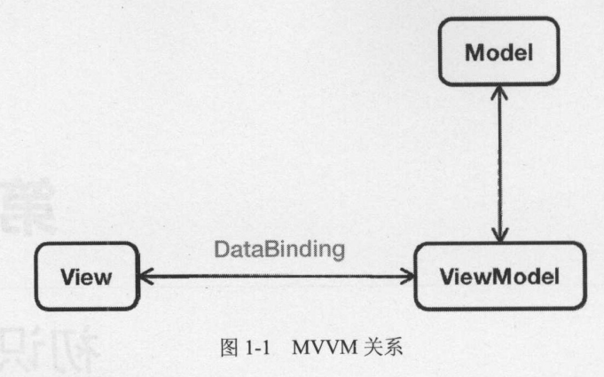
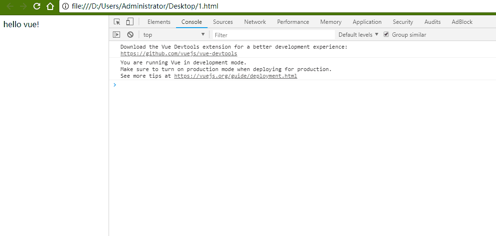
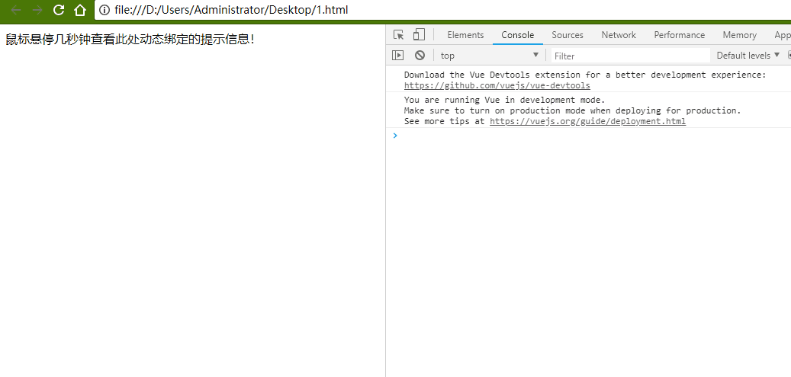
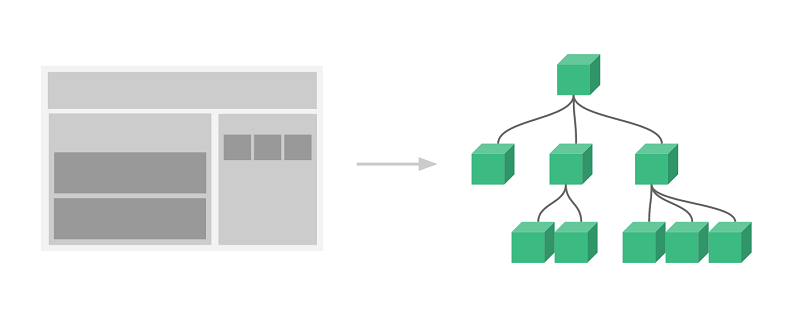

<!-- TOC -->

- [Vue](#vue)
    - [MVVM](#mvvm)
    - [Vue.js 是什么](#vuejs-%E6%98%AF%E4%BB%80%E4%B9%88)
    - [引用](#%E5%BC%95%E7%94%A8)
    - [声明式渲染](#%E5%A3%B0%E6%98%8E%E5%BC%8F%E6%B8%B2%E6%9F%93)
        - [指令](#%E6%8C%87%E4%BB%A4)
    - [条件与循环](#%E6%9D%A1%E4%BB%B6%E4%B8%8E%E5%BE%AA%E7%8E%AF)
    - [处理用户输入](#%E5%A4%84%E7%90%86%E7%94%A8%E6%88%B7%E8%BE%93%E5%85%A5)
    - [组件化应用](#%E7%BB%84%E4%BB%B6%E5%8C%96%E5%BA%94%E7%94%A8)

<!-- /TOC -->

<script src="https://cdn.jsdelivr.net/npm/vue"></script>
<a id="markdown-vue" name="vue"></a>
# Vue

<a id="markdown-mvvm" name="mvvm"></a>
## MVVM
与知名前端框架 Angular、 Ember 等一样， Vue.j s 在设计上也使用 MVVM (Model-View-ViewModel) 模式。

MVVM 模式是由经典的软件架构 MVC 衍生来的 。当 View （视图层）变化时，会自动更新到ViewModel （视图模型），反之亦然。

View 和 ViewModel 之间通过双向绑定（tdata-binding）建立联系，如下图所示：



<a id="markdown-vuejs-是什么" name="vuejs-是什么"></a>
## Vue.js 是什么
Vue (读音 /vjuː/，类似于 view) 是一套用于构建用户界面的渐进式框架。

与其它大型框架不同的是，Vue 被设计为可以自底向上逐层应用。

Vue 的核心库只关注视图层，不仅易于上手，还便于与第三方库或既有项目整合。

另一方面，当与现代化的工具链以及各种支持类库结合使用时，Vue 也完全能够为复杂的单页应用提供驱动。

<a id="markdown-引用" name="引用"></a>
## 引用
除了从官网下载js源码进行引用外，同时也推荐使用cdn方式的进行引用

github上release版本：https://github.com/vuejs/vue/releases

开发版本：
> https://vuejs.org/js/vue.js

生产版本：
> https://vuejs.org/js/vue.min.js

```html
<!-- 开发环境版本，包含了有帮助的命令行警告 -->
<script src="https://cdn.jsdelivr.net/npm/vue/dist/vue.js"></script>

<!-- 生产环境版本，优化了尺寸和速度 -->
<script src="https://cdn.jsdelivr.net/npm/vue"></script>
```

<a id="markdown-声明式渲染" name="声明式渲染"></a>
## 声明式渲染
Vue.js 的核心是一个允许采用简洁的模板语法来声明式地将数据渲染进 DOM 的系统：
```html
<!DOCTYPE html>
<html>

<head>
    <meta charset="UTF-8">
    <title></title>
    <!-- 开发环境版本，包含了有帮助的命令行警告 -->
    <script src="https://cdn.jsdelivr.net/npm/vue/dist/vue.js"></script>
</head>

<body>
    <div id="app">
        {{message}}
    </div>
</body>

<script>
    var app = new Vue({
        el: "#app",
        data: {
            message: "hello vue!"
        }
    });
</script>

</html>
```

现在数据和 DOM 已经被建立了关联，所有东西都是**响应式**的。

我们要怎么确认呢？打开你的浏览器的 JavaScript 控制台 (就在这个页面打开)，并修改 `app.message` 的值，你将看到上例相应地更新。



<a id="markdown-指令" name="指令"></a>
### 指令

```html
<body>
    <div id="app-2">
        <span v-bind:title="message">
            鼠标悬停几秒钟查看此处动态绑定的提示信息！
        </span>
    </div>
</body>

<script>
    var app2 = new Vue({
        el: '#app-2',
        data: {
            message: '页面加载于 ' + new Date().toLocaleString()
        }
    })
</script>
```

这里的 `v-bind` 特性被称为**指令**。

**指令**带有前缀 `v-`，以表示它们是 Vue 提供的特殊特性。

在这里，该指令的意思是：“将这个元素节点的 title 特性和 Vue 实例的 message 属性保持一致”。

如果你再次打开浏览器的 JavaScript 控制台，输入 `app2.message = '新消息'`，就会再一次看到这个绑定了 title 特性的 HTML 已经进行了更新。



<a id="markdown-条件与循环" name="条件与循环"></a>
## 条件与循环
控制切换一个元素是否显示也相当简单：
```html
<body>
    <div id="app-3">
        <p v-if="seen">现在你看到我了</p>
    </div>
</body>

<script>
    var app3 = new Vue({
        el: '#app-3',
        data: {
            seen: true
        }
    })
</script>
```

继续在控制台输入 `app3.seen = false`，你会发现之前显示的消息消失了。

此外，Vue 也提供一个强大的过渡效果系统，可以在 Vue 插入/更新/移除元素时自动应用过渡效果。

v-for 指令可以绑定数组的数据来渲染一个项目列表：
```html
<body>
    <div id="app-4">
        <ol>
            <li v-for="todo in todos">
                {{ todo.text }}
            </li>
        </ol>
    </div>
</body>

<script>
    var app4 = new Vue({
        el: '#app-4',
        data: {
            todos: [{
                    text: '学习 JavaScript'
                },
                {
                    text: '学习 Vue'
                },
                {
                    text: '整个牛项目'
                }
            ]
        }
    })
</script>
```

在控制台里，输入 `app4.todos.push({ text: '新项目' })`，你会发现列表最后添加了一个新项目。

<a id="markdown-处理用户输入" name="处理用户输入"></a>
## 处理用户输入

为了让用户和你的应用进行交互，我们可以用 v-on 指令添加一个事件监听器，通过它调用在 Vue 实例中定义的方法：

```html
<div id="app-5">
    <p>{{ message }}</p>
    <button v-on:click="reverseMessage">逆转消息</button>
</div>

<script>
    var app5 = new Vue({
        el: '#app-5',
        data: {
            message: 'Hello Vue.js!'
        },
        methods: {
            reverseMessage: function () {
                this.message = this.message.split('').reverse().join('')
            }
        }
    })
</script>
```
<div id="app-5">
    <p>{{ message }}</p>
    <button v-on:click="reverseMessage">逆转消息</button>
</div>

<script>
    var app5 = new Vue({
        el: '#app-5',
        data: {
            message: 'Hello Vue.js!'
        },
        methods: {
            reverseMessage: function () {
                this.message = this.message.split('').reverse().join('')
            }
        }
    })
</script>

注意在 reverseMessage 方法中，我们更新了应用的状态，但没有操作 DOM。

所有的 DOM 操作都由 Vue 来处理，你编写的代码只需要关注逻辑层面即可。

Vue 还提供了 v-model 指令，它能轻松实现表单输入和应用状态之间的双向绑定。

```html
<div id="app-6">
    <p>{{ message }}</p>
    <input v-model="message">
</div>

<script>
    var app6 = new Vue({
        el: '#app-6',
        data: {
            message: 'Hello Vue!'
        }
    })
</script>
```
<div id="app-6">
    <p>{{ message }}</p>
    <input v-model="message">
</div>

<script>
    var app6 = new Vue({
        el: '#app-6',
        data: {
            message: 'Hello Vue!'
        }
    })
</script>

<a id="markdown-组件化应用" name="组件化应用"></a>
## 组件化应用
组件系统是 Vue 的另一个重要概念，因为它是一种抽象，允许我们使用小型、独立和通常可复用的组件构建大型应用。

仔细想想，几乎任意类型的应用界面都可以抽象为一个组件树：



在 Vue 里，一个组件本质上是一个拥有预定义选项的一个 Vue 实例。在 Vue 中注册组件很简单：

```html
<div id="app-7">
    <ol>
        <!--
            现在我们为每个 todo-item 提供 todo 对象
            todo 对象是变量，即其内容可以是动态的。
            我们也需要为每个组件提供一个“key”，稍后再
            作详细解释。
          -->
        <todo-item v-for="item in groceryList" v-bind:todo="item" v-bind:key="item.id">
        </todo-item>
    </ol>
</div>

<script>
    Vue.component('todo-item', {
        props: ['todo'],
        template: '<li>{{ todo.text }}</li>'
    })

    var app7 = new Vue({
        el: '#app-7',
        data: {
            groceryList: [{
                    id: 0,
                    text: '蔬菜'
                },
                {
                    id: 1,
                    text: '奶酪'
                },
                {
                    id: 2,
                    text: '随便其它什么人吃的东西'
                }
            ]
        }
    })
</script>

```
<div id="app-7">
    <ol>
        <!--
            现在我们为每个 todo-item 提供 todo 对象
            todo 对象是变量，即其内容可以是动态的。
            我们也需要为每个组件提供一个“key”，稍后再
            作详细解释。
          -->
        <todo-item v-for="item in groceryList" v-bind:todo="item" v-bind:key="item.id">
        </todo-item>
    </ol>
</div>

<script>
    Vue.component('todo-item', {
        props: ['todo'],
        template: '<li>{{ todo.text }}</li>'
    })

    var app7 = new Vue({
        el: '#app-7',
        data: {
            groceryList: [{
                    id: 0,
                    text: '蔬菜'
                },
                {
                    id: 1,
                    text: '奶酪'
                },
                {
                    id: 2,
                    text: '随便其它什么人吃的东西'
                }
            ]
        }
    })
</script>